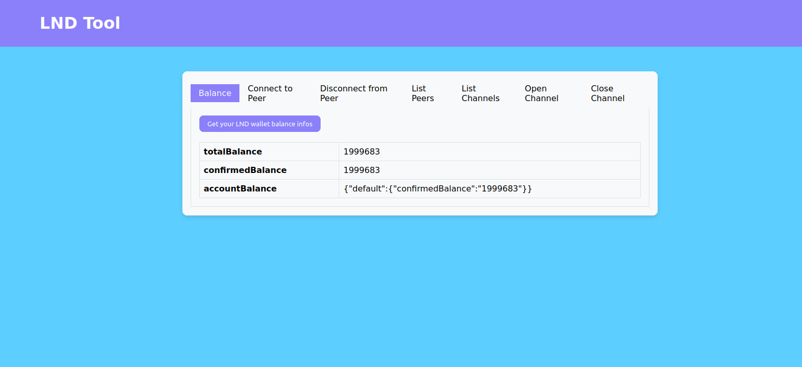
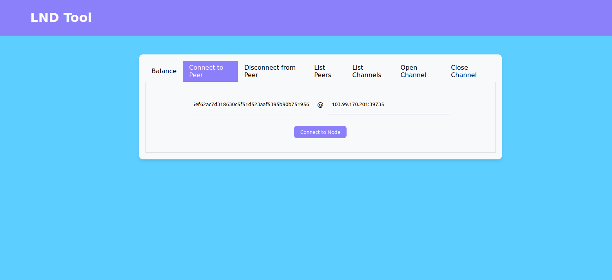
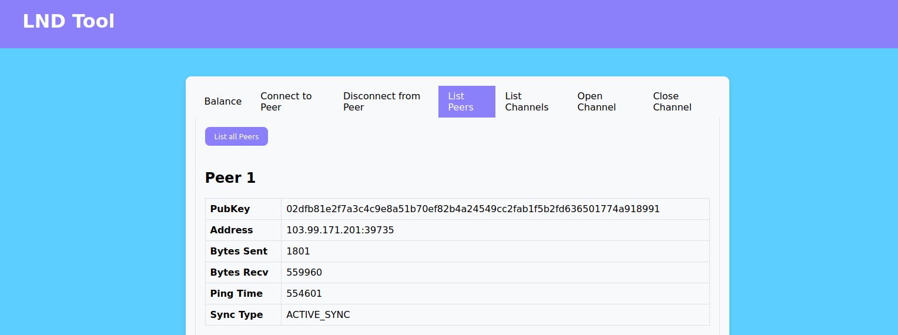
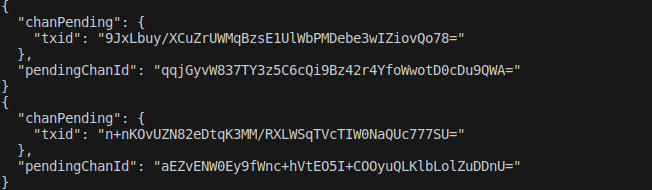

# LND Frontend

The aim of this project is to be able to use the main functions of your LND node without having to use the lncli.

## Prerequisites

You need to have a runing Bitcoin Core node as well as a Lightning Network Node (we use LND).

If you have none of the above already you can follow those links :

- [Bitcoin Core Install](https://bitcoin.org/fr/telecharger)

- [LND Install](https://github.com/lightningnetwork/lnd/blob/master/docs/INSTALL.md#installation)

After you installed it you need to have the following config if you plan to use the signet : 

The `bitcoin.conf` file is located in the `/.bitcoin` directory

Bitcoin Core Config :

```
signet=1
rpcuser=lucas
rpcpassword=lucas
zmqpubrawblock=tcp://127.0.0.1:28332
zmqpubrawtx=tcp://127.0.0.1:28333

txindex=1
listen=1
fallbackfee=0.0001

```

The `lnd.conf` is located in the `/.lnd` directory 

LND Config : 

```
[bitcoin]
bitcoin.active=1
bitcoin.node=bitcoind
bitcoin.signet=1

[bitcoind]
bitcoind.rpcuser=lucas
bitcoind.rpcpass=lucas
bitcoind.zmqpubrawblock=tcp://127.0.0.1:28332
bitcoind.zmqpubrawtx=tcp://127.0.0.1:28333

```

If after launching a new terminal you get `Command 'lnd' not found` error, try the following [fix](https://bitcoin.stackexchange.com/questions/113673/command-lnd-not-found-even-after-installing-lnd)

If you have setup your project properly you can launch your Bitcoin Core node with the `bitcoind` command in your terminal and your LND node with the `lnd` command.
You also need to have a wallet unlocked in order for LND to work. For this you can create a new wallet with the `lncli create` command and unlock it with the `lncli unlock` command and input the password you chose.

To open channels further on your wallet needs to have funds, you need an address where you can receive funds `lncli --network=signet newaddress p2wkh`
You can get signet Bitcoin on this [faucet](https://signet.bc-2.jp/)

## Project setup 

This project is setup as a classic web application with a React frontend for the visual part and a Flask backend to call the different API routes.

After having cloned this project you need to have a **virtual environment** setup in the backend folder. You can follow this [tutorial](https://flask.palletsprojects.com/en/3.0.x/installation/).

Once you have activated the venv you can install the following libraries : 

```
pip install flask
pip install flask-cors
pip install grpcio grpcio-tools googleapis-common-protos mypy-protobuf
```

If something went wrong, read this [tutorial](https://github.com/lightningnetwork/lnd/blob/master/docs/grpc/python.md).

Once the backend is setup you can run it with the following command in the backend folder (your venv must be activated): 

`flask --app main run`

To setup the frontend, you need to have Node installed on your machine.
You can the run the `npm install` command in the frontend folder to install all the required dependencies and start the project with the `npm start` command.

## The frontend

In this part you can see how the project works with attached screenshots.

In order to connect to a node you can go check this [website](https://mempool.space/fr/signet/lightning) and chose a node of your choice







